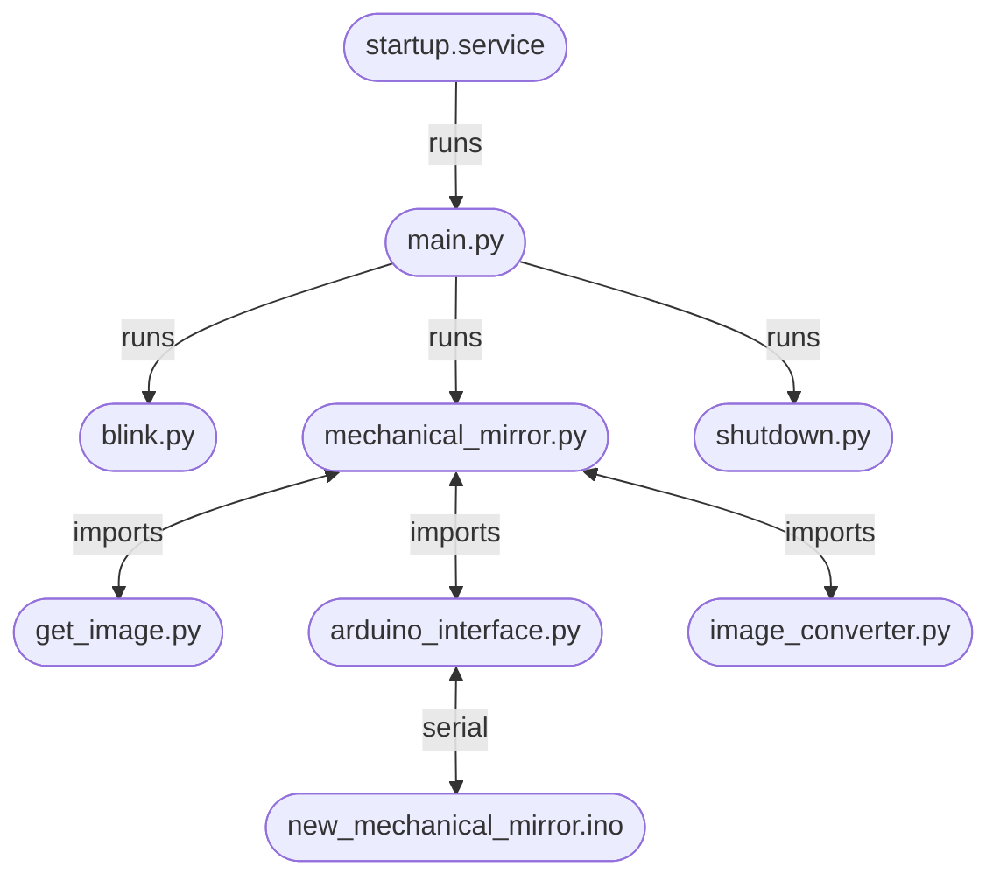

# Mechanical Mirror

This is the code for the Mechanical Mirror project from Olin's 2023 Principles of Integrated Engineering class.

## Code Structure Diagram

## File descriptions

`startup.service.text` is a `.txt` file of a systemd service that runs when the Raspberry Pi boots. It runs `main.py`.

`main.py` is run when the Raspberry Pi boots. It runs three scripts, each in a different thread. These scripts are `blink.py`, `shutdown.py`, and `mechanical_mirror.py`.

`blink.py` continually blinks an LED connected to GPIO pin 12 on the Raspberry Pi. This is used to indicate when the Pi has booted or shut down.

`shutdown.py` waits for GPIO pin 3 to be pulled to ground and then shuts down the Raspberry Pi. Acts as a shutdown button.

`mechanical_mirror.py` is the main mechanical mirror setup and loop. It imports `get_image.py`, `image_converter.py`, and `arduino_interface.py`.

`get_image.py` contains an `imageGetter` that has functions to read images from the camera based on the operating system.

`image_converter.py` contains an `imageConverter` object that has functions that convert a background and subject image to data that can be displayed on the mechanical mirror.

`arduino_interface.py` contains an `arduinoInterface` object that manages the serial connection with the Arduino microcontroller (or simulates the microcontroller). It has functions to send commands to the Arduino and logic for converting the data from an `imageConverter` object to commands to display the image on the mechanical mirror.

`new_mechanical_mirror/new_mechanical_mirror.ino` is the version of the Arduino code that runs on the 13x15 mechanical mirror. It has manages the serial connection and runs functions to control the actuators based on the commands it recieves. 

`mechanical_mirror/mechanical_mirror.ino` is the version of the Arduino code that ran on earlier sprints and has been kept because it may still be needed in the future.

`requirements.txt` is a list of the required packages to run this project.

`display_array.py` displays a single array defined at the start of the file. This was used to demonstrate the mirror displaying recognizable images.

`test_mechanical_mirror.py`, `test_servos.py`, and `test.py` are files used to test components of the code and are not part of the main code web.

`.gitignore` is the gitignore file. It makes sure that the state is not kept over multiple devices.

`README.md` is this file.